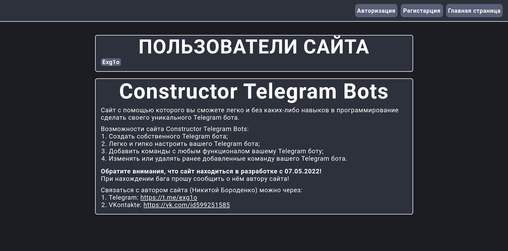
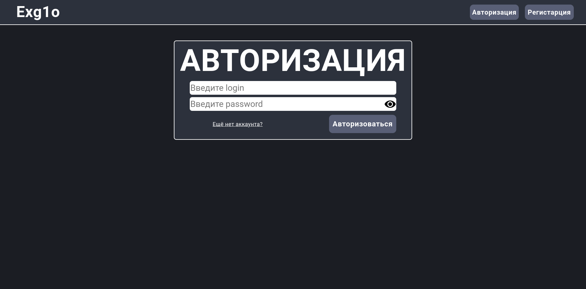
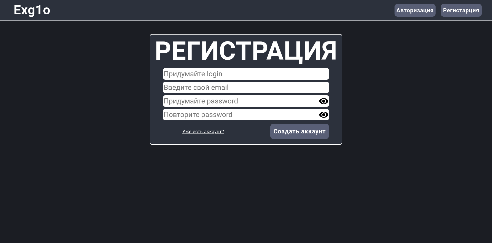
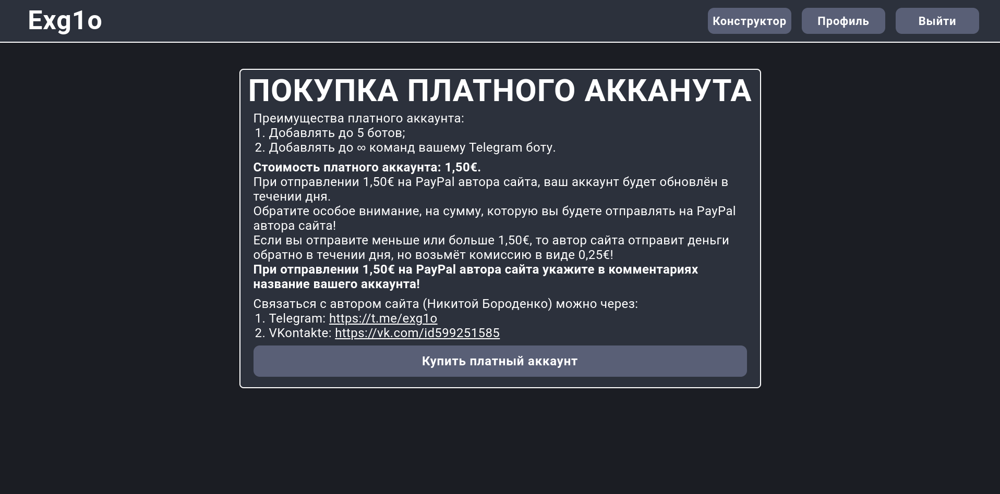
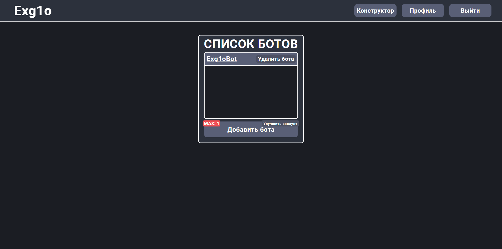
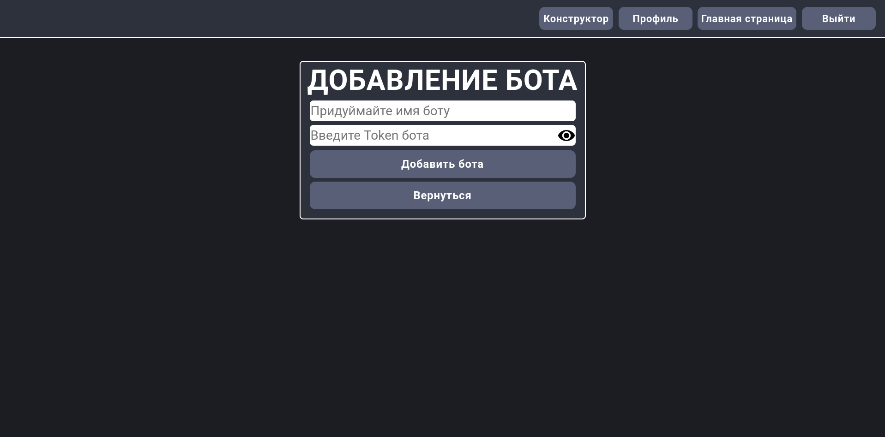
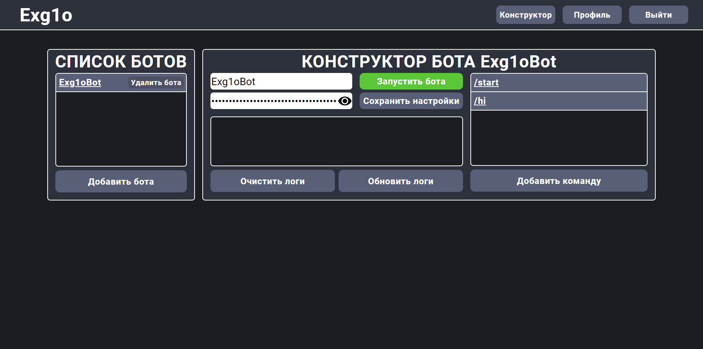
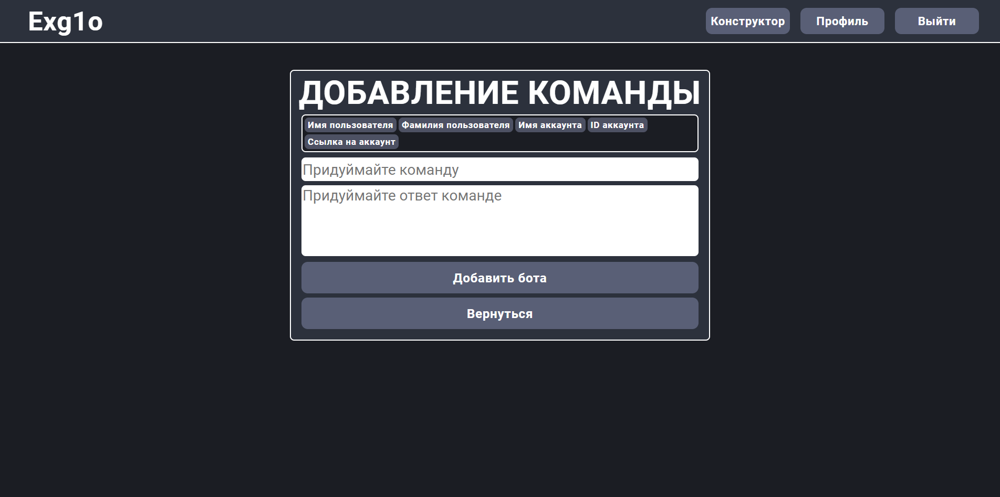
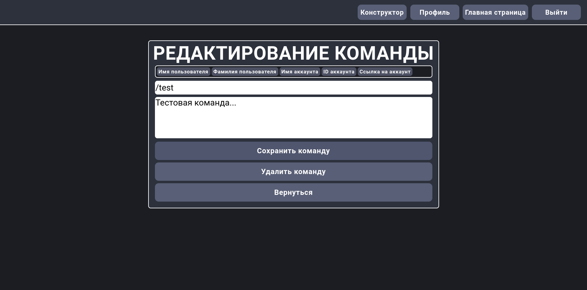

# WebSite Exg1o
**WebSite Exg1o** - сайт с помощью которого вы сможете легко и без каких либо навыков в программирование сделать своего Telegram бота.

# Возможности сайта
- Создать собственного Telegram бота;
- Легко и гипко настроить вашего Telegram бота;
- Добавить команды с любым функционалом вашему Telegram боту;
- Изменять или удалять ранее добавленные команду вашего Telegram бота.

# Установка и использовани
1. Устанавливаем **Python 3.9.0**;
2. Устанавливаем и запускаем сайт:
```sh
git clone https://github.com/EXG1O/WebSite-Exg1o.git
cd WebSite-Exg1o/exg1o/exg1o
```
3. В файле **settings.py** на **27** строке меняем константу **DEBUG**:
```sh
DEBUG = True
```
4. Запускаем сайт:
```sh
python manage.py runserver
```
5. Если всё успешно запустилось, то в консоль должно вывестись это:
```sh
Watching for file changes with StatReloader
Performing system checks...

System check identified no issues (0 silenced).
June 13, 2022 - 11:49:34
Django version 4.0.4, using settings 'exg1o.settings'
Starting development server at http://127.0.0.1:8000/
Quit the server with CTRL-BREAK.
```
6. Пользуемся сайтом 😊!

# Демонстрация сайта
## Главная страница

## Страница авторизации

## Страница регистрации

## Страница аккаунта

## Страница улучшения аккаунта

## Страница списка Telegram ботов

## Страница добавления Telegram бота

## Страница конструктора Telegram бота

## Страница добавление команды Telegram боту

## Страница редактирования команды Telegram бота
